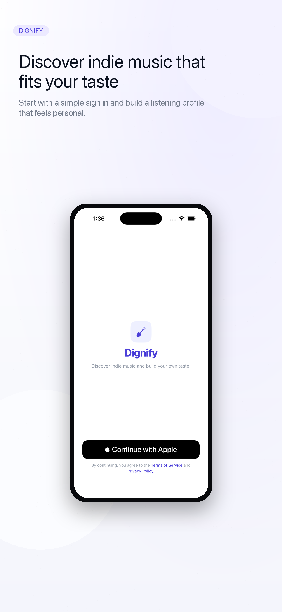
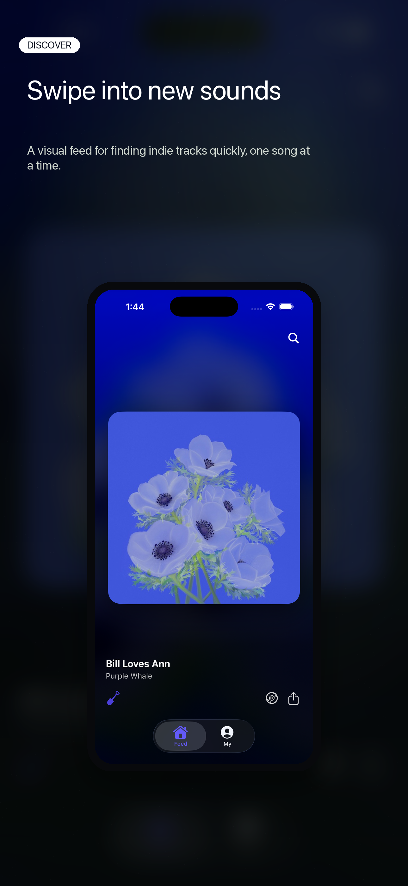
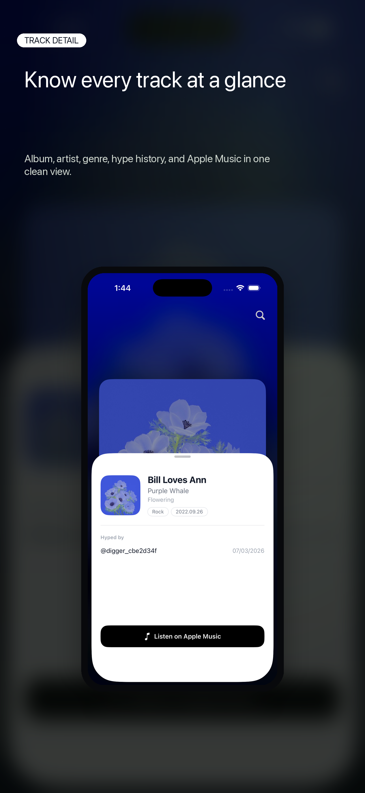
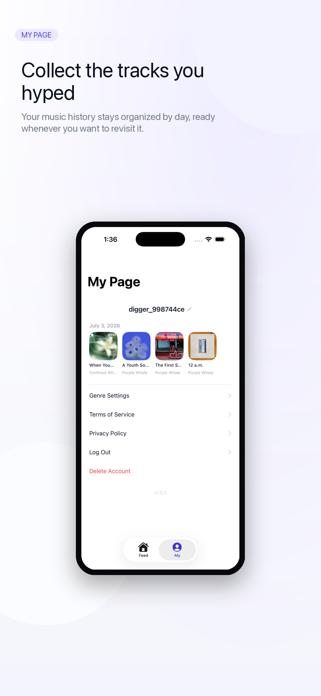
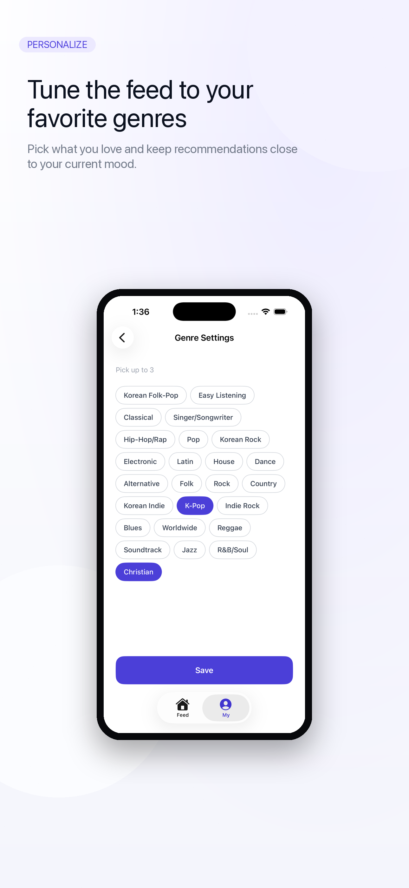

# Dignify — Discover indie music, one swipe at a time

> A reels-style iOS app for **music digging**: swipe through short preview clips, "hype" the tracks you love, and build a personal listening history. Built on the insight that *a good song is recognizable in 10–20 seconds*.

**iOS (SwiftUI) · Swift Concurrency · AVFoundation · Apple Sign In · Live on the App Store**

| | |
|---|---|
| **Platform** | iOS 26.5, iPhone-only, portrait-locked |
| **Language / UI** | Swift 5, SwiftUI, `@Observable` (Observation framework) |
| **Audio** | AVFoundation (AVPlayer sliding window) |
| **Backend** | Spring Boot on Cloud Run + Cloud SQL (Postgres), custom REST client |
| **Auth** | Sign in with Apple + guest mode |
| **Music source** | iTunes Search / Lookup API (curated), Apple Music affiliate links |
| **Status** | ✅ Approved & shipped on the App Store (v1.0.2) |

---

## Screens

| Onboarding | Feed | Track Detail |
|:--:|:--:|:--:|
|  |  |  |
| One-tap **Sign in with Apple**, or browse as a guest. Genre picker seeds the first feed. | Full-screen vertical feed. Swipe to the next track and audio starts **instantly**; double-tap to hype; share a track link. | Bottom sheet with album/artist/genre, **hype history** ("hyped by"), and a deep link to **Apple Music**. |

| My Page | Genre Settings |
|:--:|:--:|
|  |  |
| Your hyped tracks grouped by day, inline nickname editing, tap-to-preview, account actions (logout / delete). | Pick up to 3 genres; saving re-fetches the feed against your new taste. |

---

## Engineering highlights

The interesting work is in `dignify/dignify/Core`. Below are the parts I'd point a reviewer at.

### 1. AVPlayer sliding window — instant playback on swipe
`Core/Audio/FeedAudioController.swift`

A vertical feed can't afford to spin up an `AVPlayer` on each swipe — the first second of a fresh player is silence while it buffers. The controller keeps a **3-track window** (`current-1 / current / current+1`) alive at all times:

- Only `current` actually plays; the neighbors exist purely to **pre-buffer**, so the moment the swipe settles, sound is already ready.
- Tracks that leave the window are torn down (players, loop observers, time observers) so memory stays flat regardless of feed length — metadata lives in the view, not here.
- A single `isPaused` flag is the **one source of truth** for playback state. Tap-to-toggle, interruptions, backgrounding, and track changes all write it; the view only reads it. No divergent state to reconcile.
- **Fade in/out** is computed from a periodic time observer (`fadeVolume(at:duration:)`, pure + unit-testable), giving smooth loops instead of hard cuts.
- Handles the real world: `AVAudioSession` interruptions (calls), route changes (headphones unplugged → pause, no surprise speaker blast), and looping via `AVPlayerItemDidPlayToEndTime`.

### 2. Network layer — actor + single-flight token refresh
`Core/Network/APIClient.swift`

A hand-rolled `async/await` REST client (no Alamofire) built as an **`actor`** so token state is race-free by construction:

- On a `401`, it runs `/auth/refresh` and retries the original request **once**. If many requests 401 at the same time, `performRefresh()` collapses them onto a **single in-flight `Task`** — the refresh runs exactly once and everyone awaits the same result.
- **Refresh-token rotation**: the new refresh token from the response is persisted every time, not just the access token.
- Access/refresh tokens live in the **Keychain** (`TokenStore`), restored on cold launch.
- Typed error envelope (`{code, message}`) surfaced as `APIError`, with a debug-only `[API]` request/response log that compiles out of release builds.
- Endpoints are value types (`Endpoint`), keeping the transport dumb and the call sites declarative (`Core/Network/Endpoints.swift`).

### 3. Guest mode without a second code path
`App/AppSession.swift`

The app shipped after an App Store rejection (5.1.1 — forced-login wall). The fix was a `guest` auth state rather than a parallel unauthenticated stack:

- Account-only surfaces (hype, detail, My Page) gate through a single `pendingSignIn` trigger that raises the sign-in sheet; the feed itself stays open.
- `onAuthFailure` is **guarded for guests** — a guest hitting an authenticated endpoint gets a 401 but is *not* kicked to `signedOut`, so browsing survives.
- Signing in from guest **re-fetches the feed** so already-hyped tracks drop out.

### 4. Feed continuity across restarts
`Features/Feed/FeedView.swift`

The feed cursor carries a random seed server-side, so a `null` cursor reshuffles from scratch. To make "pick up where you left off" work, the cursor is persisted in `@AppStorage("feedCursor")` and replayed on launch. Search swaps the feed out via a `FeedSnapshot` and restores the original list (and its audio window) on dismiss. New pages prefetch the next tracks' artwork so scrolling never stalls on an image load.

### 5. Tab-aware audio
SwiftUI's `TabView` fires `onAppear`/`onDisappear` unreliably, which caused audio to keep playing on the wrong tab. The fix routes the *selected tab* through `AppSession.selectedTab` and drives the audio window off `onChange` of that value + `scenePhase` — a deterministic signal instead of lifecycle callbacks you can't trust.

### 6. Small in-house design system
`Core/DesignSystem/` — typography, colors, radii, button styles, genre chips, a shimmer skeleton for feed loading, a `FlowLayout` for wrapping chips, and a `RemoteImage` that up-sizes iTunes 100×100 artwork to 600×600 via URL rewriting. No UI dependencies.

---

## Project layout

```
dignify/dignify/
├── App/            AppSession, root view, tab container, auth-state routing
├── Core/
│   ├── Audio/      FeedAudioController (AVPlayer sliding window)
│   ├── Network/    APIClient (actor), TokenStore (Keychain), Endpoints, DTOs
│   ├── Models/     Feed, Genre
│   └── DesignSystem/  typography, color, chips, shimmer, RemoteImage, FlowLayout
└── Features/
    ├── Onboarding/ Apple Sign In + genre selection
    ├── Feed/       swipe feed, double-tap hype, search, track detail sheet
    ├── MyPage/     hype library (grouped by day), genre settings, account
    └── Legal/      in-app Safari web view for ToS / Privacy
```

~3,500 lines of Swift.

---

## Notes

- **Music sourcing** is curation-first: tracks are pulled via iTunes Lookup (filtered by `artistId` to drop collabs) and inserted with a priority so hand-picked artists surface early in the feed.
- **Localization**: English base with a Korean string catalog; export-compliance and privacy declarations completed for App Store submission.
</content>
