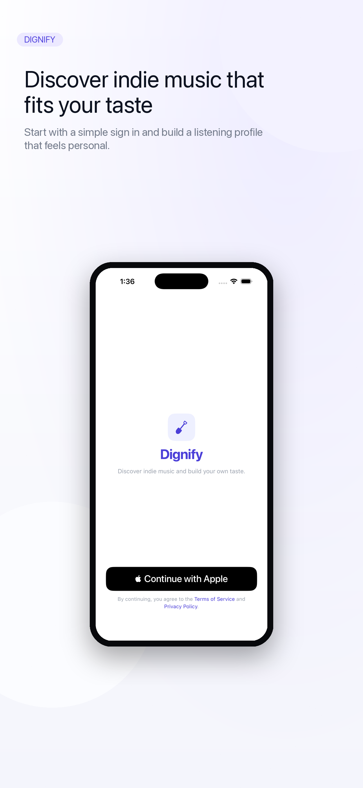
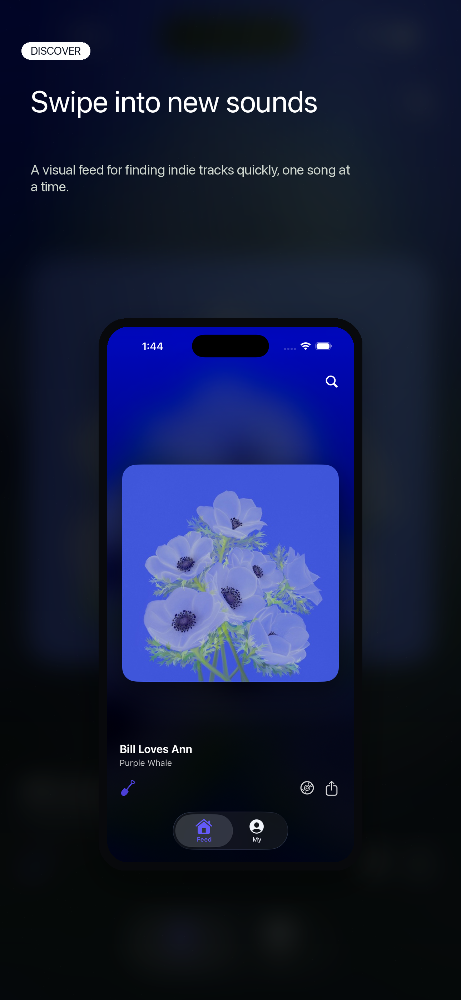
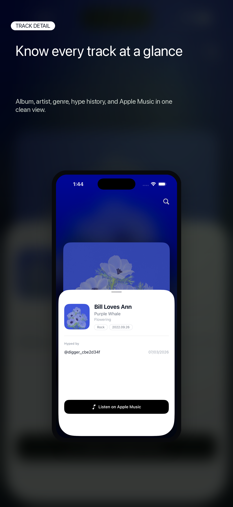
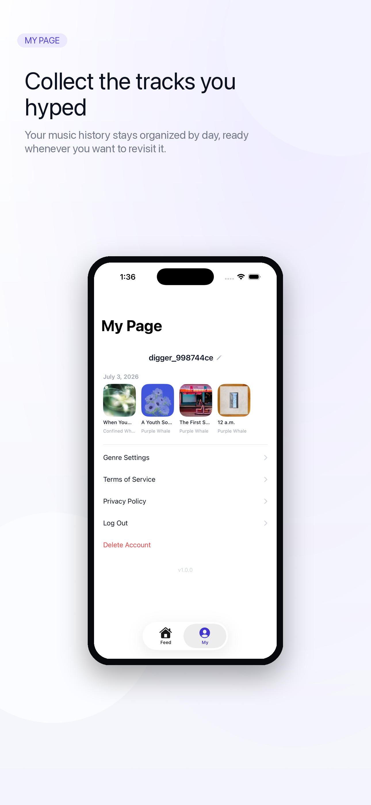

# Dignify — Discover indie music, one swipe at a time

> A reels-style iOS app for **music digging**: swipe through short preview clips, "hype" the tracks you love, share sets of songs with other diggers, and watch the feed reorder itself around your taste. Built on the insight that *a good song is recognizable in 10–20 seconds*.

**iOS (SwiftUI) · Swift Concurrency · AVFoundation · Apple Sign In · APNs · Live on the App Store**

| | |
|---|---|
| **Platform** | iOS 17+, iPhone-only, portrait-locked, light-mode only |
| **Language / UI** | Swift 5, SwiftUI, `@Observable`, `MainActor`-by-default isolation |
| **Audio** | AVFoundation (AVPlayer sliding window) |
| **Backend** | Spring Boot on Cloud Run + Cloud SQL (Postgres), custom REST client |
| **Auth** | Sign in with Apple + guest mode |
| **Music source** | iTunes Search / Lookup API (curated), Apple Music & YouTube Music links |
| **Push** | APNs direct (curation drops, reaction milestones) |
| **Analytics** | PostHog (the only third-party dependency) |
| **Status** | ✅ Shipped on the App Store — current version **1.1.0** (build 21) |

---

## Screens

Screenshots below are from the 1.0.x App Store listing; the genre picker they showed has since been replaced by the sound rounds described under *Personalization*.

| Onboarding | Feed | Track Detail | Your crate |
|:--:|:--:|:--:|:--:|
|  |  |  |  |
| One-tap **Sign in with Apple**, or browse as a guest. A short tutorial hands off to three listen-and-choose rounds that seed the first feed. | Full-screen vertical feed. Swipe and audio starts **instantly**; double-tap to hype; share a track card. | Bottom sheet with album/artist/genre, **hype history** ("hyped by"), and deep links out to Apple Music / YouTube Music. | Hyped tracks grouped by day, tap-to-preview, and the entry point for picking which tracks the feed recommends from. |

Three tabs: **Feed**, **Picks** (community sets), **My** (profile, digging stats, account).

---

## Engineering highlights

The interesting work is in `dignify/dignify/Core` and `Features/`. Below are the parts I'd point a reviewer at.

### 1. AVPlayer sliding window — instant playback on swipe
`Core/Audio/FeedAudioController.swift`

A vertical feed can't afford to spin up an `AVPlayer` on each swipe — the first second of a fresh player is silence while it buffers. The controller keeps a **3-track window** (`current-1 / current / current+1`) alive at all times:

- Only `current` actually plays; the neighbors exist purely to **pre-buffer**, so the moment the swipe settles, sound is already ready.
- Tracks that leave the window are torn down (players, loop observers, time observers) so memory stays flat regardless of feed length — metadata lives in the view, not here.
- A single `isPaused` flag is the **one source of truth** for playback state. Tap-to-toggle, interruptions, backgrounding, and track changes all write it; the view only reads it. No divergent state to reconcile.
- **Fade in/out** is computed from a periodic time observer (`fadeVolume(at:duration:)`, pure + unit-tested), giving smooth loops instead of hard cuts.
- Handles the real world: `AVAudioSession` interruptions (calls), route changes (headphones unplugged → pause, no surprise speaker blast), and looping via `AVPlayerItemDidPlayToEndTime`.
- The same controller is reused by every surface that makes sound — feed, pick playback, onboarding rounds, preview taps in lists — with `modalAudioActive` muting the feed underneath, because a full-screen cover doesn't change the selected tab and two players would otherwise overlap.

### 2. Network layer — actor + single-flight token refresh
`Core/Network/APIClient.swift`

A hand-rolled `async/await` REST client (no Alamofire) built as an **`actor`** so token state is race-free by construction:

- On a `401`, it runs `/auth/refresh` and retries the original request **once**. If many requests 401 at the same time, `performRefresh()` collapses them onto a **single in-flight `Task`** — the refresh runs exactly once and everyone awaits the same result.
- **Refresh-token rotation**: the new refresh token from the response is persisted every time, not just the access token.
- Access/refresh tokens live in the **Keychain** (`TokenStore`), restored on cold launch.
- Typed error envelope (`{code, message}`) surfaced as `APIError`, with a debug-only `[API]` request/response log that compiles out of release builds.
- Endpoints are value types (`Endpoint`), keeping the transport dumb and the call sites declarative (`Core/Network/Endpoints.swift`).

### 3. Guest mode without a second code path
`App/AppSession.swift`

The app shipped after an App Store rejection (5.1.1 — forced-login wall). The fix was a `guest` auth state rather than a parallel unauthenticated stack:

- Account-only surfaces (hype, detail, My Page, composing a pick) gate through a single `pendingSignIn` trigger that raises the sign-in sheet; the feed itself stays open.
- `onAuthFailure` is **guarded for guests** — a guest hitting an authenticated endpoint gets a 401 but is *not* kicked to `signedOut`, so browsing survives.
- Signing in from guest **re-fetches the feed** so already-hyped tracks drop out.

### 4. Personalization — the feed answers the last tap
`Features/Onboarding/SoundRoundsView.swift`, `Features/MyPage/SeedPickerView.swift`, `Features/Feed/FeedView.swift`

The backend ranks the feed by mood similarity to a handful of **seed tracks** (audio embeddings, not genre labels). The client's job is to make that legible:

- **Onboarding asks with sound, not words.** Three rounds of "which of these two?" — the chosen track is hyped, so the answer *is* the seed. No genre checkboxes (they were deleted, ~1,000 lines with them). The rounds run once for updating users too, and a user with no candidates simply skips them and lands on the cold-start feed.
- `refreshUpcoming()` rebuilds **only the cards you haven't seen yet** right after a hype, keeping `currentIndex` and its player untouched. Without it the reordering shows up 10–20 tracks later, by which point nobody connects it to what they pressed. It bails out (leaving the old behavior) on search, curation sets, and any failure.
- Because `currentIndex` doesn't change, `onChange` never fires — the refresh calls `audio.updateWindow` itself, or the discarded next track would still be queued up.
- `upcoming(after:from:)` drops tracks already swiped past this session: the server only excludes hyped and curated tracks, and a reordering can float an already-seen track back to the top.
- **Recommend-from** lets a user pin up to 3 of their hyped tracks as the seeds instead of the most recent ones, reusing `HypeCollection` in selection mode so it reads as "choose from what you kept."

### 5. Community picks — optimistic reactions, local moderation
`Features/Picks/`

A pick is a small set of tracks someone shares; others play it and drop a 🔥.

- Reactions are a single `PUT` upsert and are applied **optimistically**, rolling back just the affected card on failure — a `DELETE` of a reaction that isn't there still counts as success, or a toggled-off reaction would come back to life.
- Titles run through shared client-side validation (`PickTitle`) that mirrors the server rule, so the error appears before the round trip.
- **Blocking and report-hiding are client-side** (`LocalModeration`): there is no block table on the server, and the list is bounded by "people one user blocked". Stored as newline-joined text because `@AppStorage` can't hold an array.
- Picks and profiles share one 9:16 `ImageRenderer` share card pipeline (`Features/Share/`, `PickShareCardView`, `ProfileShareCardView`). `ImageRenderer` ignores blur and renders without a width proposal, so the cards use radial gradients and an explicit `.frame(width:)` — otherwise text silently clips horizontally while looking fine vertically.

### 6. Digging Profile — derived on the client
`Features/DiggingProfile/DiggingStats.swift`

`GET /users/me/stats` returns counts only. Every label — the 2×2 taste type (selectivity × breadth), the "you dig X but keep Y" headline, the unlock threshold — is computed here from client-side constants, so tuning the thresholds against real data never needs a backend deploy. Unit-tested at the axis boundaries.

### 7. Coach marks that measure the real UI
`Features/Onboarding/CoachMarks.swift`

One-time overlays that cut a hole around an actual control on four different screens. **No coordinates are written anywhere**: the target view publishes its `bounds` via `anchorPreference`, and the overlay reads it back through `GeometryProxy[anchor]` in its own space — post-layout measurements, so the hole lands correctly on an SE, a Pro Max, or at large Dynamic Type, and the card flips above or below the target depending on where it sits. The whole thing is wrapped in a function rather than inlined, because `overlayPreferenceValue` with a generic closure pushes long view chains (`FeedView`) past the type-checker's budget.

### 8. Feed continuity across restarts
The feed cursor carries a random seed server-side, so a `null` cursor reshuffles from scratch. The cursor is persisted in `@AppStorage("feedCursor")` and replayed on launch. Search swaps the feed out via a `FeedSnapshot` and restores the original list (and its audio window) on dismiss. New pages prefetch upcoming artwork so scrolling never stalls on an image load.

### 9. Tab-aware audio
SwiftUI's `TabView` fires `onAppear`/`onDisappear` unreliably, which caused audio to keep playing on the wrong tab. The fix routes the *selected tab* through `AppSession.selectedTab` and drives the audio window off `onChange` of that value + `scenePhase` — a deterministic signal instead of lifecycle callbacks you can't trust.

### 10. Push, and asking for it at the right moment
`App/AppDelegate.swift`, `Features/Feed/PushOptInPopup.swift`

SwiftUI has no APNs token API, so a `UIApplicationDelegate` hands the hex token to the live `AppSession`. Notifications also present in the foreground, and a curation push routes to the feed tab with the set pulled back to the front — announcing a track and then opening a generic feed loses the track. The system permission prompt is only reached through a soft prompt shown **after finishing a curated set**, and declining it calls nothing, leaving the status `.notDetermined` so the ask survives for a later, better moment.

### 11. Small in-house design system
`Core/DesignSystem/` — typography, colors, radii, button styles, search bar, a shimmer skeleton for loading, and a `RemoteImage` that up-sizes iTunes 100×100 artwork to 600×600 via URL rewriting. No UI dependencies.

---

## Project layout

```
dignify/dignify/
├── App/                AppSession, root view, tab container, auth routing, APNs delegate
├── Core/
│   ├── Audio/          FeedAudioController (AVPlayer sliding window)
│   ├── Network/        APIClient (actor), TokenStore (Keychain), Endpoints, DTOs
│   ├── Models/         Feed
│   └── DesignSystem/   typography, color, radius, buttons, search bar, shimmer, RemoteImage
└── Features/
    ├── Onboarding/     tutorial, sound rounds (2-choice seeding), coach marks
    ├── Feed/           swipe feed, double-tap hype, search, detail sheet, push opt-in
    ├── Picks/          community sets: list, compose, reactions, share card, moderation
    ├── DiggingProfile/ listening stats, taste type, taste share card
    ├── MyPage/         hype library, recommend-from seed picker, account
    ├── ArtistRequest/  request an artist + request history
    ├── Share/          9:16 track share card (ImageRenderer)
    ├── WhatsNew/       local changelog shown after an update
    └── Legal/          in-app Safari web view for ToS / Privacy
```

~9,500 lines of Swift, plus 19 unit tests (Swift Testing) and UI tests covering the guest path.

---

## Notes

- **Music sourcing** is curation-first: tracks are pulled via iTunes Lookup (filtered by `artistId` to drop collabs) and inserted with a priority so hand-picked artists surface early in the feed.
- **Analytics rule**: events fire at the point the server confirms the action, and any event with several call sites lives in one shared helper — event names and property keys are kept identical to the Android client so both feed one funnel.
- **Localization**: English base with a Korean string catalog. Note that Xcode generates Swift symbols from catalog keys, so number interpolation goes through `Text(verbatim:)`.
- **Light mode only** (`UIUserInterfaceStyle = Light`) — the palette is hard-coded light, and system chrome was the only thing following the system theme.
